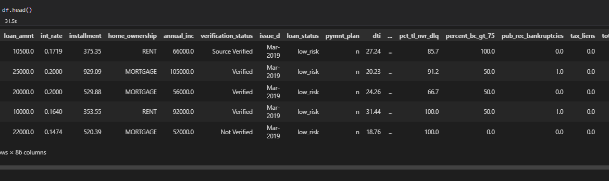
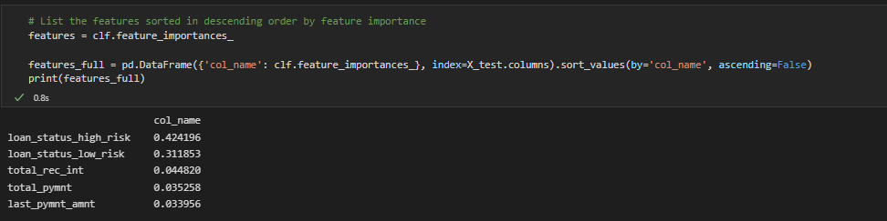

# Credit Risk Analysis

## Introduction to the analysis

LendingClub, a peer-to-peer lending services company, has asked that we help Jill their lead machine learning analyst. They have asked Jill and us to build a machine learning model which will help evaluate the credit risk of a person asking for a loan.

Credit risk is an inherently unbalanced classification problem, as good loans easily outnumber risky loans. Therefore, you’ll need to employ different techniques to train and evaluate models with unbalanced classes. Jill asks you to use different techniques to build and evaluate models for evaluating credit risk.

## Data

We are asked to utilize  credit data for customers to help train our model.Since we know if we have given the customer a loan or not, we are utilizing supervised training methods. Our data contains different information about the customer credit history and current credit position. It contains such elements as:

<ul>
<li>Loan amount requested</li>
<li>Loam payment amount</li>
<li>Current home ownership</li>
<ul>
<li>Rent</li>
<li>Own</li>
<li>Own - Have a mortgage</li>
</ul>
<li>Current income</li>
<li>Current risk status of the loan
</li>
<ul>
<li>Low risk</li>
<li>High risk</li>
</ul>
<li>Payment history of debt</li>
<ul>
<li>Behind in payments</li>
<li>Bankruptcies</li>
<li>Liens</li>
</ul>
</ul>

## Results

Jill asked us to utilize a number of methods to build the machine model utilized to help evaluate the loan applicants credit risk.

The following methods were utilized to build models for predicting the credit risk of an applicant:

<table>
<tr>
<td>Balanced Accuracy</td>
<td>What is the average percentage of correct predictions by class?</td>
</tr>
<tr>
<td>Precision</td>
<td>What total percent of your predictions were correct?</td>
</tr>
<tr>
<td>Recall</td>
<td>What percent of the positive cases did you catch?</td>
</tr>
<tr>
<td>F1 Score</td>
<td>What percent of positive predictions are correct?</td>
</tr>
</table>

1. Random Over Sampling
 	- accuracy score 65.14
 	- Precision: .99
 	- Recall: .61  
 	- F1: .75
2. SMOTE Over Sampling
	- accuracy score 65.66
	- Precision: .99
 	- Recall: .69
 	- F1: .81
3. Cluster Centroids
	- accuracy score 54.37
	- Precision: .99
	- Recall: .41
 	- F1: .57
4. SMOTEENN
	- accuracy score 65.57
	- Precision: .99
	- Recall: .55
 	- F1: .70
5. Random Forest Classifier
	- accuracy score 50.00
	- Precision: .99
	- Recall: .99
 	- F1: .99
6. ADA Boost Classifier
	- accuracy score 50.00
	- Precision: .99
	- Recall: .99
 	- F1: .99

## Analysis

After reviewing our different machine models some interesting things showed up in the results. First, all of the models had a precision of .99. The other interesting thing is that the balanced accuracy scores for the models weren't as positive as the accuracy. They ranged between .50 and 65.66.

The real test of these models is the the F1 score. The different models ran from a low of .75 to a high of .99 for their F1 scores.

If we review the data a little, we find the following:

<table>
<tr>
<td>Low-Risk</td>
<td>101 applicants</td>
</tr>
<tr>
<td>High-Risk</td>
<td>17104 applicants</td>
</tr>
</table>

The other thing we see, when we determine the important factors in the model's training, we see that loan status risk is the biggest factor affecting the model. With this risk, both low and high, accounting for 73.5% of importance for the model.

This has made some of the analysis truly challenging and has led to large differences in balanced accuracy scores and precision scores. while a number of the models seem to work for high-risk applicants well, they don't work well for low-risk applicants. With this in mind, I would recommend more research to find a more suitable approach to building the model for this dataset.